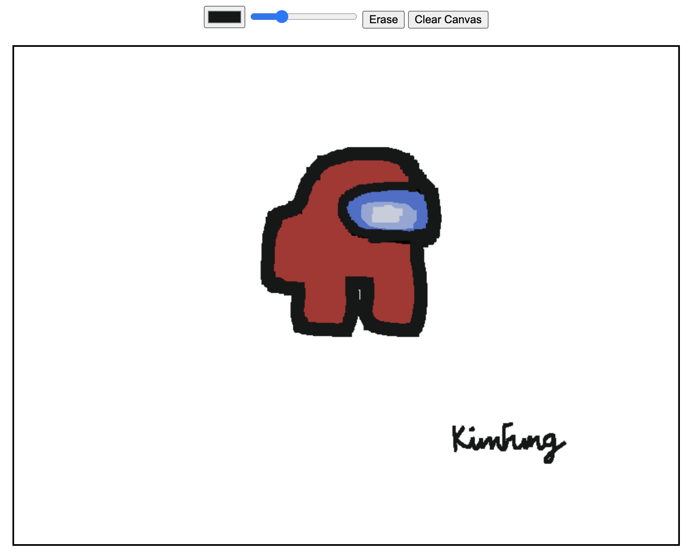

# Drawing App in Svelte

 

### App Functionality:
- Pick Color
- Change Line Thickness
- Erase
- Clear Canvas

### How to Run

Once you've created a project and installed dependencies with `npm install` (or `pnpm install` or `yarn`),\
simply start a development server by running `npm run dev -- --open`

It will automatically open the app in a new browser tab.